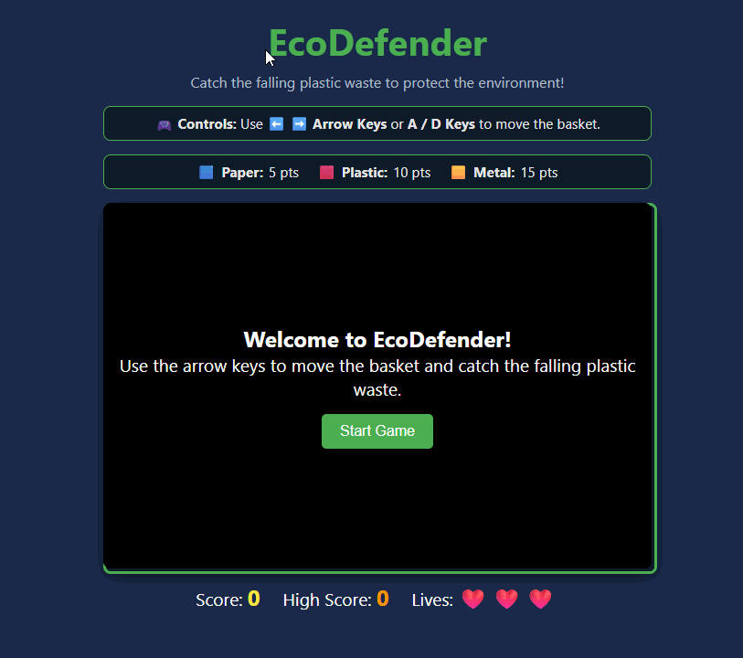

# 🌿 EcoDefender

An interactive HTML5 Canvas game designed to raise environmental awareness by sorting falling paper, plastic, and metal waste.

---

## 🎥 Feature Demonstration

### Key Features Demonstrated
* **Interactive Start & Control UI:** Clear start overlay, controls guide (Arrow / A-D keys), and waste color legend informing players of point values (Paper = 5pts, Plastic = 10pts, Metal = 15pts).
* **Player Movement & Canvas Physics:** Smooth horizontal movement bounded strictly within canvas edge limits.
* **Dynamic Collision & Scoring:** Real-time waste catching mechanics with visual pop feedback, synthesized audio effects via Web Audio API, and progressive speed scaling.
* **State Persistence & High Score:** Real-time updates and browser `localStorage` integration to save persistent record scores across sessions.
* **HUD State Management & Restart Loop:** Visual life tracking (`❤️`), immediate Game Over popup display, and instant state reset upon pressing the Restart button.

### Alignment with Project Plan
* **Educational & Gameplay Mechanics:** The color-coded waste classification directly supports the objective of creating an engaging environmental awareness game.
* **Technical Requirements:** The integration of `localStorage`, native Web Audio API, collision logic, and responsive UI overlays fulfills all functional specifications outlined in the project plan.

---

## 🎮 How to Play

### Controls
* **Move Left:** `⬅️ Left Arrow` or `A` key
* **Move Right:** `➡️ Right Arrow` or `D` key

### Waste Legend & Points
* 🟦 **Paper:** 5 points
* 🟥 **Plastic:** 10 points
* 🟨 **Metal:** 15 points

---

## 🛠️ Tech Stack

* **HTML5 Canvas:** Game loop, rendering, and collision detection physics.
* **CSS3:** Layout styling, responsive HUD, overlays, and `.score-pop` visual animations.
* **JavaScript (ES6+):** Web Audio API sound synthesis, `localStorage` state persistence, and event handling.

---

## 👥 Team
* EcoDefender Project Team — Developed for Course Project.